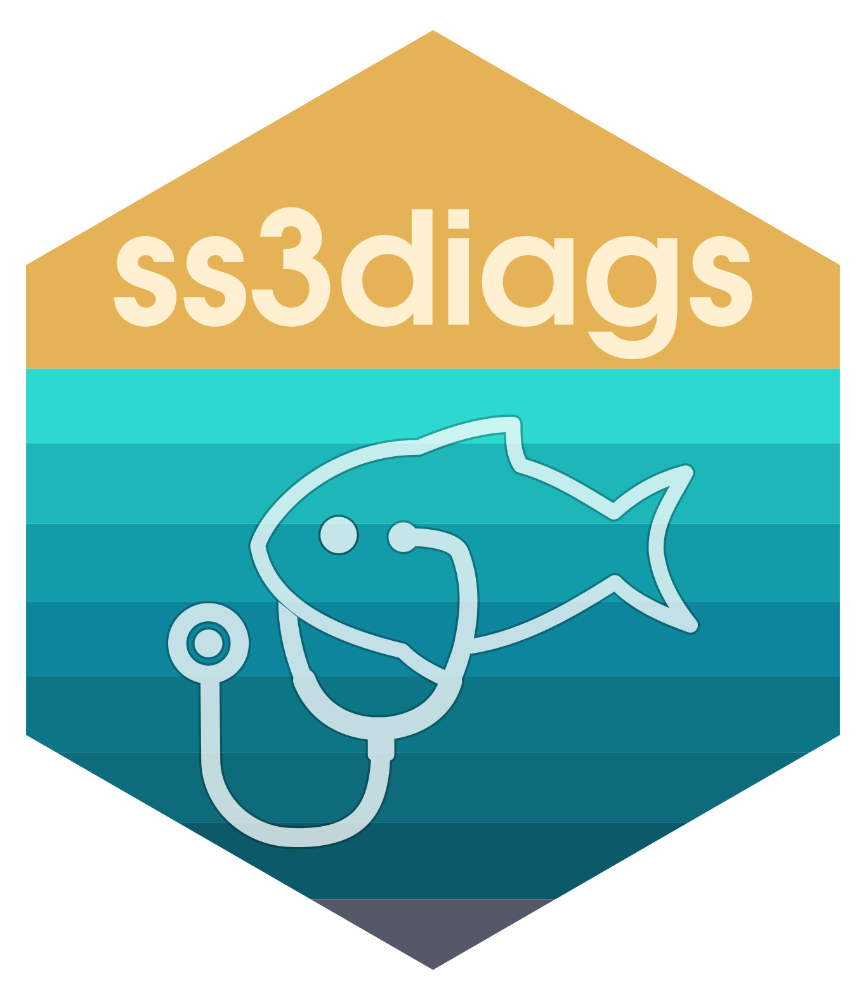

<!-- README.md is generated from README.Rmd. Please edit that file -->

```{r, include = FALSE}
knitr::opts_chunk$set(
  collapse = TRUE,
  comment = "#>",
  fig.path = "man/figures/README-",
  out.width = "100%",
  fig.show = "hold"
)
```

# ss3diags  <a href="http://nmfs-ost.github.io/ss3diags/"></a>

<!-- badges: start -->
[](https://github.com/nmfs-ost/ss3diags/actions)
<!-- badges: end -->


The R package `ss3diags` enables users to apply advanced diagnostics to
evaluate a Stock Synthesis model. Diagnostics include residual analyses,
hindcast cross-validation techniques, and retrospective analyses.
Functions also allow users to reproduce the key model diagnostics plots
that are presented in the paper ‘A Cookbook for Using Model Diagnostics in
Integrated Stock Assessments’ [(Carvalho et al. 2021)](https://www.sciencedirect.com/science/article/pii/S0165783621000874).

The `ss3diags` Github repository provides step-by-step R recipes on how
to:

-   [Run jitter
    analysis](https://nmfs-ost.github.io/ss3diags/articles/Jitter.html)
-   [Conduct retrospective
    analysis](https://nmfs-ost.github.io/ss3diags/articles/Retrospective-Analysis.html)
-   [Use hindcast
    cross-validation](https://nmfs-ost.github.io/ss3diags/articles/hcxval.html)
-   [Do log-likelood profiling for
    R0](https://nmfs-ost.github.io/ss3diags/articles/likelihood.html)
-   [Run the ASPM
    diagnostic](https://nmfs-ost.github.io/ss3diags/articles/aspm.html)
-   [Evaluate model fit](https://nmfs-ost.github.io/ss3diags/articles/residuals.html)


with Stock Synthesis by making use of a comprehensive collection of R functions available in the R packages [`r4ss`](https://github.com/r4ss/r4ss) and `ss3diags`.

## Installation

`ss3diags` is not currently supported on CRAN. You can install the development version of `ss3diags` from [GitHub](https://github.com/) with:

``` r
# install.packages("remotes")
remotes::install_github("nmfs-ost/ss3diags")
```
Once the package is installed it can be loaded by:

```{r example}
library(ss3diags)
```
For examples of how to run common diagnostic tests for SS models and visualize the results of those diagnostic tests using the `r4ss` and `ss3diags` packages, please refer to the articles on the package [website](https://nmfs-ost.github.io/ss3diags/).


## Contributing to ss3diags  
If you would like to contribute to `ss3diags` or have suggestions for diagnostic tests to include in the package, you can submit a new [issue](https://github.com/nmfs-ost/ss3diags/issues) or email Meg at megumi.oshima@noaa.gov.

## Reference
To cite `ss3diags` for a publication you can use 
```{r citation}
citation("ss3diags")
```

## Disclaimer

The United States Department of Commerce (DOC) GitHub project code is provided on an ‘as is’ basis and the user assumes responsibility for its use. DOC has relinquished control of the information and no longer has responsibility to protect the integrity, confidentiality, or availability of the information. Any claims against the Department of Commerce stemming from the use of its GitHub project will be governed by all applicable Federal law. Any reference to specific commercial products, processes, or services by service mark, trademark, manufacturer, or otherwise, does not constitute or imply their endorsement, recommendation or favoring by the Department of Commerce. The Department of Commerce seal and logo, or the seal and logo of a DOC bureau, shall not be used in any manner to imply endorsement of any commercial product or activity by DOC or the United States Government.”

<!-- What is special about using `README.Rmd` instead of just `README.md`? You can include R chunks

You'll still need to render `README.Rmd` regularly, to keep `README.md` up-to-date. `devtools::build_readme()` is handy for this. You could also use GitHub Actions to re-render `README.Rmd` every time you push. An example workflow can be found here: <https://github.com/r-lib/actions/tree/v1/examples>.

In that case, don't forget to commit and push the resulting figure files, so they display on GitHub and CRAN.-->


